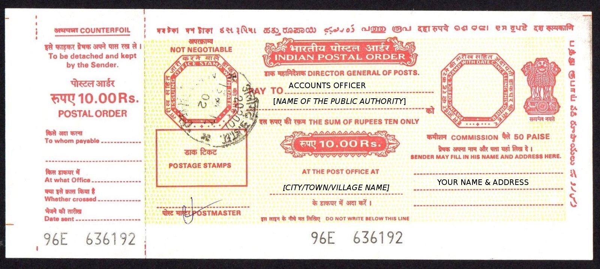

# RTI Application

RTI or Right to Information is an act passed by the Government of India in 2005. As per the RTI Act, any citizen of India may request information from any “Public Authority”. For more information on RTI please refer to this [article](https://medium.com/rtilikho/what-is-rti-30f532a1b5fe). There are 3 major steps in filing an RTI application -

## 1. Write the RTI Application

The Right to Information Act 2005 does not prescribe any specific format for an RTI application. One can simply write their query in a clear and concise manner on a paper and the Public Information Officer is duty bound to respond in a fair manner. For a simple format click [here](../formats/basic-rti-format.md).


The application can be either printed or handwritten


## 2. Submit RTI fee

There are a number of ways in which you can deposit the RTI fee of Rs 10. The easiest method is via an IPO or Indian Postal Order. To get hold of an IPO go to the nearest post office and ask for an IPO of Rs.10/- from one of the counters. You should be given a slip as shown in the image below

Fill the necessary information as shown in the image and then carefully tear the counterfoil on the left hand side. Keep the counterfoil with you as a proof of payment and enclose the actual IPO along with your RTI application in an envelope.

## 3. Post the RTI application

Use only Speed Post or Registered Post service from a post office to courier the RTI application. This will allow you to track your application which will serve as a proof of delivery in case a dispute arises and you need to file an appeal. The PIO cannot falsely claim that he/she never received your application.


Make sure your application is addressed to the correct “Public Authority” or the right department


If you have any doubts & additional queries regarding the filing of RTI applications feel free to contact us on [Twitter](https://twitter.com/rtilikho).

